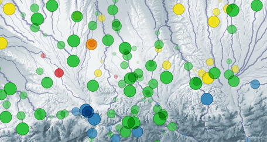

# 30DayMapChallenge-2023
30 days, 30 maps

Official repo : [https://github.com/tjukanovt/30DayMapChallenge](https://github.com/tjukanovt/30DayMapChallenge)

## [Jour 1 : des points](day1.md)

Evolution, sur quelques années, de la qualité physico-chimique des rivières. \
Mots clés : QGis, Expressions, Time-manager

## Ressources

- https://data.humdata.org/dataset/kontur-population-dataset
- https://www.gsi.go.jp/kankyochiri/gm_global_e.html (végétation)
- https://pcjericks.github.io/py-gdalogr-cookbook/raster_layers.html (cost path)
- https://www.gebco.net/data_and_products/gridded_bathymetry_data/ (bathy)
- https://dataverse.ird.fr/dataset.xhtml?persistentId=doi:10.23708/T37S0K (îles)
- https://cartonumerique.blogspot.com/p/fonds-carte-sig.html
- https://www.iucnredlist.org/resources/spatial-data-download (espèces)
- http://worldmapcreator.com/#!/application (projections)