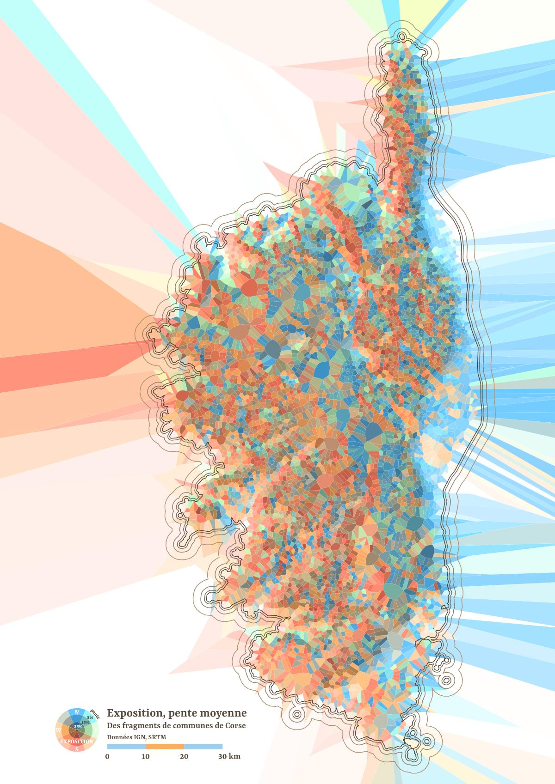

# 30DayMapChallenge-2023
30 days, 30 maps

Official repo : [https://github.com/tjukanovt/30DayMapChallenge](https://github.com/tjukanovt/30DayMapChallenge)

Tenté par le défi, vous ne trouverez pas là de belles cartes quotidiennes, mais quelques bouts de code et recettes autour de QGis, que je manipule depuis qq années déjà.

## [Jour 1 : des points](day1.md)

Evolution, sur quelques années, de la qualité physico-chimique des rivières. \
Mots clés : QGis, Expressions, Time-manager

## [Jour 2 : des lignes](day2.md)

Un texte posé sur courbes de niveau.

[En grand](https://flic.kr/s/aHBqjB1Sdv)

QGis, Python

## [Jour 3 : des polygones](day3.md)

La Corse en petits polygones de voronoï, exposition et pentes.

QGis

## [Jour 4 : A bad map](day4.md)

Projection, titre, couleurs... que du beau !

## Jour 5 : Analog Map

Un cèdre sec. Réserve naturelle des cèdres du Chouf, Liban. 

https://flic.kr/s/aHBqjB1Sdv

## [Jour 6 : Asia](day6.md)

Terres en mer... 

## Jour 7 : Navigation

Les îles du milieu
ou îles (massive) centrales

https://flic.kr/s/aHBqjB1Sdv

Données : IGN RGE Alti, OpenStreetMap

## Jour 8 : Africa

Terres en mer...  voir jour 6 pour la technique exploitée.

https://flic.kr/s/aHBqjB1Sdv

## [Jour 9 : Hexagons](day9.md)

Sur une idée d'un (petit) neveu, tentative non aboutie de rendu 'fantasy'... mais où sont les hexagones ?

Réponse sous le titre.

## Jour 10 : North America

Terres en mer, encore.\
cf. Jour 6.

## Ressources utilisées pour le défi

- https://adour-garonne.eaufrance.fr/catalogue/1dee5bac-215e-4ea5-9e34-66e1bd9a70a1
- https://population.un.org/wpp/Download/Standard/MostUsed/ (stats population U.N.)
- https://www.gebco.net/data_and_products/gridded_bathymetry_data/  (bathy)
- https://www.naturalearthdata.com/downloads/
- https://geoservices.ign.fr/rgealti (dem france)
- https://www.openstreetmap.org
  