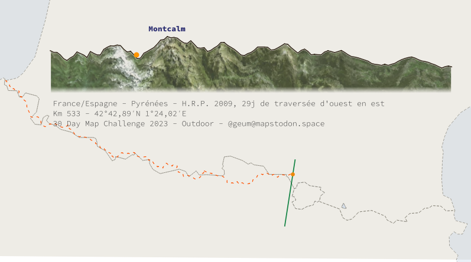

# 30DayMapChallenge-2023
30 days, 30 maps

Official repo : [https://github.com/tjukanovt/30DayMapChallenge](https://github.com/tjukanovt/30DayMapChallenge)

Tenté par le défi, vous ne trouverez pas là de belles cartes quotidiennes, mais quelques bouts de code et recettes autour de QGis, que je manipule depuis qq années déjà.

## [Jour 1 : des points](day1.md)


Evolution, sur quelques années, de la qualité physico-chimique des rivières. \
Mots clés : QGis, Expressions, Time-manager


## [Jour 2 : des lignes](day2.md)


Un texte posé sur courbes de niveau.

[En grand](https://flic.kr/s/aHBqjB1Sdv)


QGis, Python

## [Jour 3 : des polygones](day3.md)


La Corse en petits polygones de voronoï, exposition et pentes.

QGis

## [Jour 4 : A bad map](day4.md)

Projection, titre, couleurs... que du beau !


## Jour 5 : Analog Map

Un cèdre sec. Réserve naturelle des cèdres du Chouf, Liban. 


https://flic.kr/s/aHBqjB1Sdv

## [Jour 6 : Asia](day6.md)

Terres en mer... 


## Jour 7 : Navigation

Les îles du milieu
ou îles (massive) centrales


https://flic.kr/s/aHBqjB1Sdv

Données : IGN RGE Alti, OpenStreetMap

## Jour 8 : Africa

Terres en mer...  voir jour 6 pour la technique exploitée.


https://flic.kr/s/aHBqjB1Sdv

## [Jour 9 : Hexagons](day9.md)

Sur une idée d'un (petit) neveu, tentative non aboutie de rendu 'fantasy'... mais où sont les hexagones ?

Réponse sous le titre.


## Jour 10 : North America

Terres en mer, encore.\
cf. Jour 6.


## [Jour 11 : Retro](day11.md)

Une vieille carte d'excursion.


## Jour 12 : South America


## Jour 13 : Choropleth

Premier tour des élections présidentielles (FR) 2022.
Choroplèthe à 4 composantes de couleurs pour 4 familles politiques (CMYK, ou CMJN pour cyan, magenta, jaune, noir).


Expression à utiliser pour la couleur (QGis). Au préalable, créer les colonnes "scores" adéquates selon vos idées.

L'amplitude des couleurs est améliorée par la normalisation des scores, image trop fade sinon !

```python
color_cmyka(
	100*("score_famille_a")/maximum("score_famille_a"), 
	100*("score_famille_b")/maximum("score_famille_b"), 
	100*("score_famille_c")/maximum("score_famille_c"), 
	100*("score_famille_d")/maximum("score_famille_d"), 
	255
)
```
données : https://www.data.gouv.fr/fr/datasets/election-presidentielle-des-10-et-24-avril-2022-resultats-definitifs-du-1er-tour/

## Jour 14 : Europe


## [Jour 15 : OpenStreetMap](day15.md)

Des échangeurs autoroutiers démesurés


Données : OpenStreetMap

## Jour 16 : Oceania


Données : https://dataverse.ird.fr/dataset.xhtml?persistentId=doi:10.23708/T37S0K

## Jour 17 : Flow

Les rivières du sud-ouest (fr) en papier découpé. 


Outil : QGis+Python. 

Données : bd Carthage.

Des expressions, un peu de python un jour, si j'arrive à déboguer et me relire !

## Jour 18 : Atmosphere

Comparaison des températures mensuelles avec la période 1940-1949 (du même mois), sur la France.

La palette du bleu au rouge pour des écarts de -6° à +6°C. Deux années dans la largeur.

On remarque l'hiver 56 en haut à gauche, celui de 86 aussi. Des réchauffements plutôt hivernaux... 

données : https://cds.climate.copernicus.eu/cdsapp#!/dataset/reanalysis-era5-single-levels-monthly-means


## [Jour 19 : 5 minutes](day19.md)


En plus fin là : https://flic.kr/s/aHBqjB1Sdv\
données : https://opensky-network.org/datasets/states


## [Jour 20 : Outdoor](day20.md)

2009, une traversée des Pyrénées en 28j, un itinéraire magnifique. Animation du trajet, le paysage défile.



[](https://raw.githubusercontent.com/xcaeag/30DayMapChallenge-2023/main/maps/30days2023-day20-outdoor.mp4)


La HRP : https://fr.wikipedia.org/wiki/Haute_randonn%C3%A9e_pyr%C3%A9n%C3%A9enne

Données : https://www.naturalearthdata.com/downloads/

## [Jour 21 : Raster](day21.md)

Un "style" pour calcul statistique de la couche raster.


## Jour 22 : North is not always up

Les villes de bord de mer regardent vers le large. Vive les données vectorielles pour pivoter tout ça.. ici pour un rendu type "scan 25" de l'IGN.


En plus fin là : https://flic.kr/s/aHBqjB1Sdv\

Données : Contributeurs Open Street Map, IGN (courbes de niveau).

## Jour 23 : 3D

Pyrénées Ariègeoises, des profils empilés, relief légèrement exagéré.


## Jour 24 : B&W


Des polygones OpenStreeMap, classés par surface croissante (les petites au dessus). Utiliser l'ordre de rendu des entités avec "$area" ascendant. Ainsi les bâtiments viennent par dessus.

Je n'utilise pas de contour, mais un remplissage Blanc avec un mode de fusion "différence".

Même principe pour les textes et décorations : blanc + fusion "différence".

Données : Open Street Map Contributors du 20/11/2023.

## Ressources utilisées pour le défi

- https://adour-garonne.eaufrance.fr/catalogue/1dee5bac-215e-4ea5-9e34-66e1bd9a70a1
- https://population.un.org/wpp/Download/Standard/MostUsed/ (stats population U.N.)
- https://www.gebco.net/data_and_products/gridded_bathymetry_data/  (bathy)
- https://www.naturalearthdata.com/downloads/
- https://geoservices.ign.fr/rgealti (dem france)
- https://www.openstreetmap.org
- https://www.data.gouv.fr/fr/datasets/election-presidentielle-des-10-et-24-avril-2022-resultats-definitifs-du-1er-tour/
- https://download.bbbike.org
- https://dataverse.ird.fr/dataset.xhtml?persistentId=doi:10.23708/T37S0K (îles)
- https://cds.climate.copernicus.eu/cdsapp#!/dataset/reanalysis-era5-single-levels-monthly-means
- https://opensky-network.org/datasets/states
