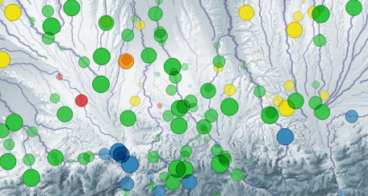

## Jour 1 : Points

Evolution, sur quelques années, de la qualité physico-chimique des rivières. 

Mesurée en des points 'station qualité', les analyses aggrégées en indicateurs annuels sont ici animées sur 1 km en amont et en aval, et persistent 3 ans pour donner l'impression de couler !



Mots clé : QGis, Expressions, Time-manager, générateur de géométrie.

Un enregistrement de la table contient : une date, un tronçon de rivière (linestring de 2km), une valeur de classe (la couleur).

L'expression pour générer le point, glissant le long du tronçon : 

```python
# @days_3years : une variable de projet = 3*365
# "date_deb" : la date de la donnée (champ de table)
line_interpolate_point( 
    smooth($geometry), 
    $length * (
        (max(min(day(age(@map_start_time , "date_deb")), @days_3years), 0)) /  @days_3years 
    )
)
```

L'expression pour régler la taille des pastilles (même principe pour la transparence) :
```python
# @value pour permettre un réglage fin en utilisant la valeur par défaut comme facteur.
@value * 5000 *
(
	1-
	(max(
		min(
			day(age( @map_start_time , "date_deb"))
			, @days_3years 
		), 
		0
	)
	) / @days_3years  
)
```

Les données : [https://adour-garonne.eaufrance.fr/catalogue/1dee5bac-215e-4ea5-9e34-66e1bd9a70a1](https://adour-garonne.eaufrance.fr/catalogue/1dee5bac-215e-4ea5-9e34-66e1bd9a70a1)

