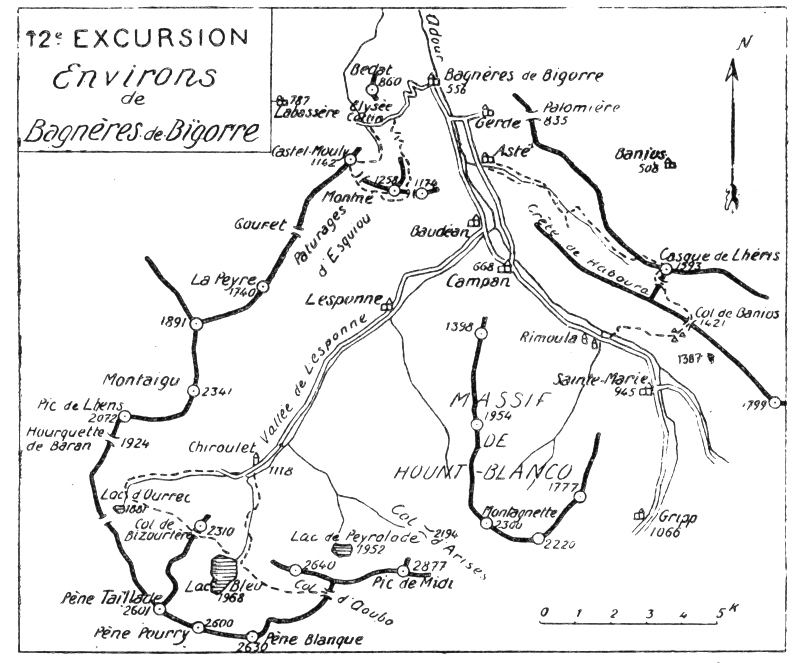
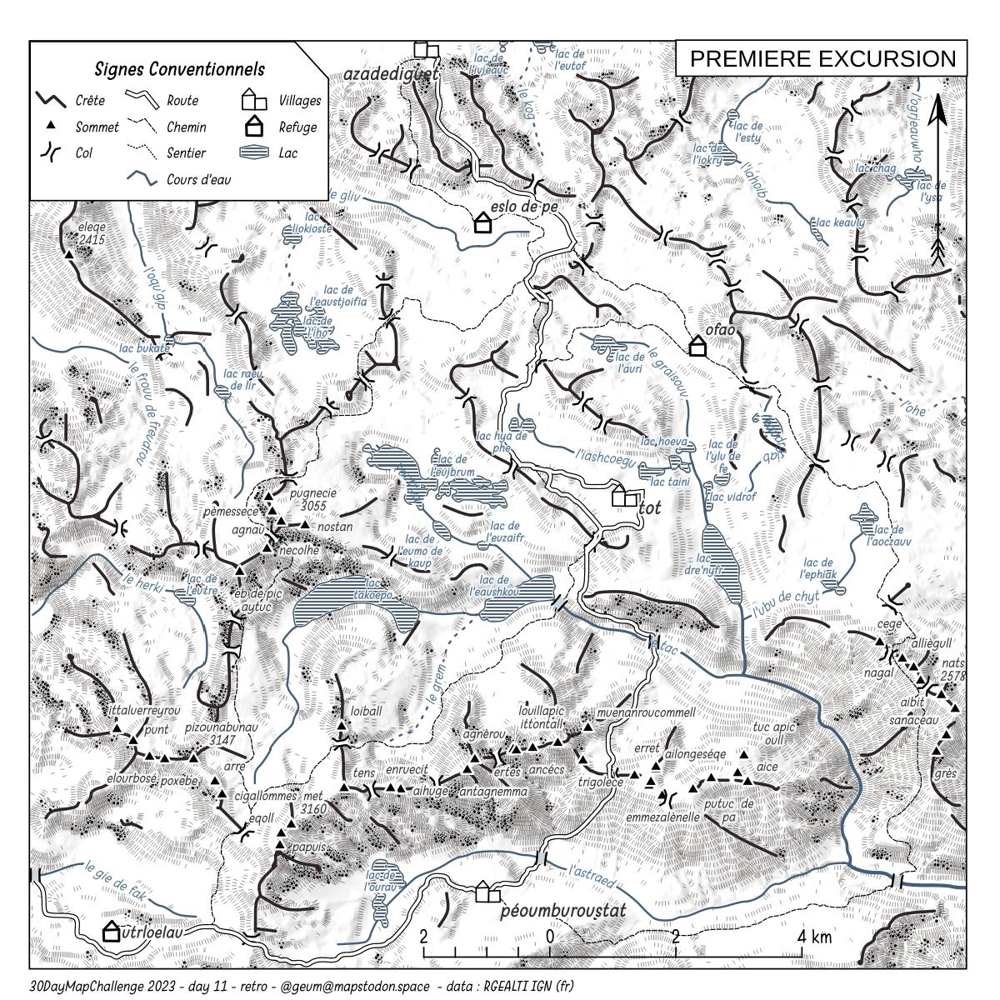

## Jour 11 : Retro

__Une vieille carte d'excursion__

Guide Soubiron - Les Pyrénées du pic d'Anie au Canigou en 40 excursions

A vouloir essayer de représenter mes randos en montagne à la façon des vieux guides, après pas mal de tatonnements et recherche des bons algos, notamment pour produire les lignes de crêtes, j'en suis arrivé à faire tout générer à partir d'un simple modèle numérique de terrain. Sommets, crêtes, rivières, villages, refuges, chemins, lacs.. des lieux imaginaires donc, placés sur un 'vrai' terrain.

Certains reconnaîtrons quelques vagues formes de lacs ou l'emplacement de sommets Pyrénéens. Villages, refuges et chemins sont fictifs.

Les scripts ne sont pas beaux et n'ai pas le temps de les améliorer, je donne là quelques noms d'algo utilisés... en plus de la panoplie qu'offre la boîte à outils de traitements (couper, transformer, simplifier, tampon, etc...) 

Pour les rivières : grass7:r.watershed, grass7:r.stream.extract

Pour les chemins : le bon plugin LeastCostPath ( https://github.com/Gooong/LeastCostPath)

__Ressources__

RGE Alti, le MNT de l'IGN. (https://geoservices.ign.fr/rgealti) 

