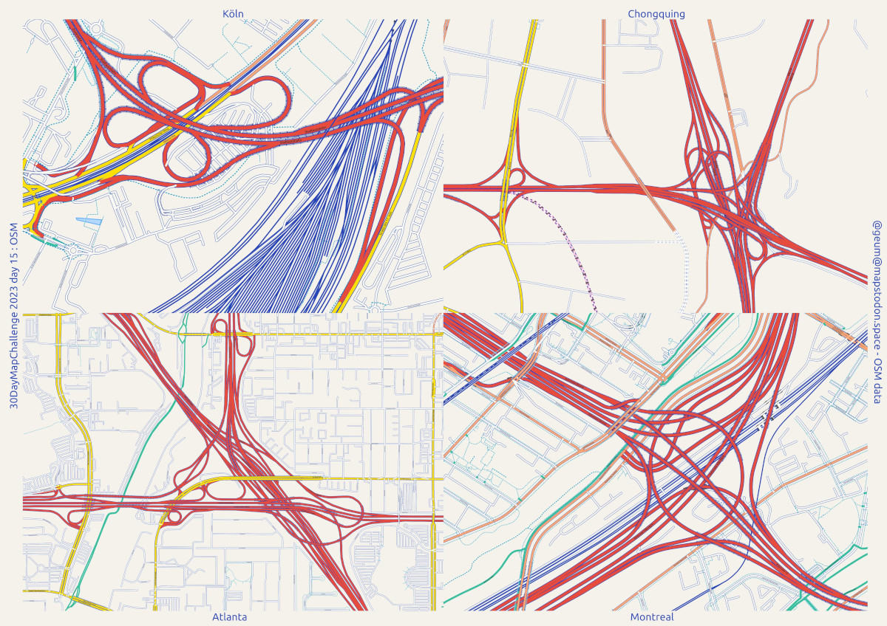
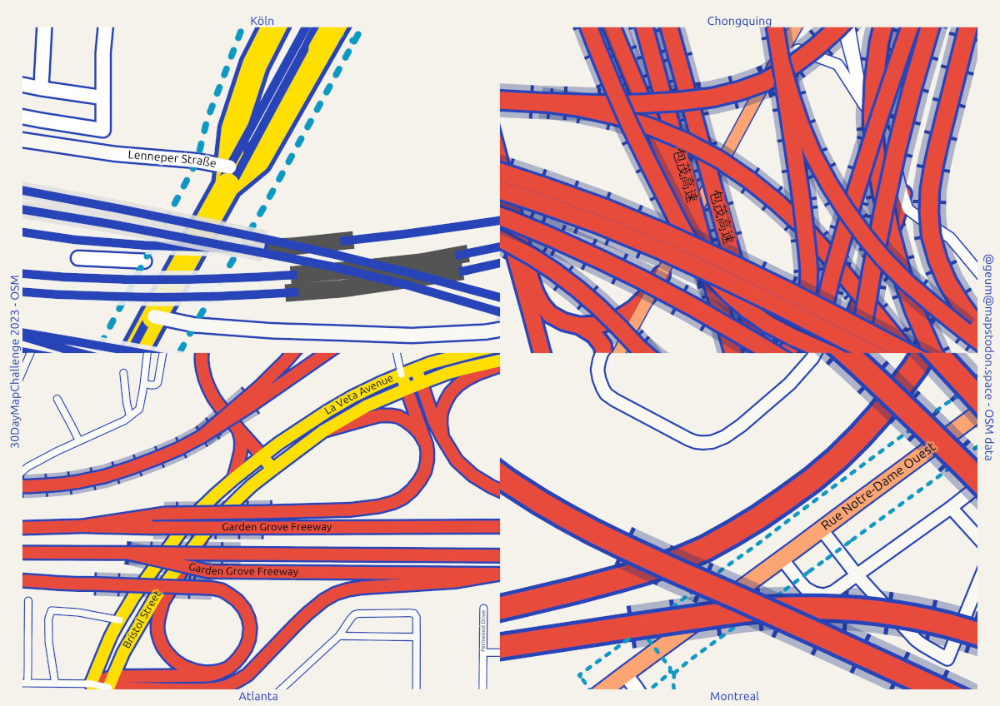

## Jour 15 : OpenStreetMap

__Des échangeurs autoroutiers démesurés__

Quelle difficulté de représenter les routes, à grande échelle !

Peut-être qu'il existe une solution plus simple ?

Jouer avec les tag 'layer', 'z_order' d'OSM, les couches QGis, les règles dans les styles, les niveaux de symbole, les masques, les couleurs de projet, les variables... bref, un casse tête.

Les unités... mm ? point ? carte ? 

Les couches... les multiplier, filtrer les données par valeurs de 'layer' ?

Ici, me suis arrêté sur un bon gros style, sur une seule couche de linéaire, table issue d'un fichier PBF d'OSM à laquelle j'ai ajouté les champs (tags osm) : highway, railway, layer, bridge, tunnel, name, z_order. C'est la notion de 'niveaux de symbole' qui gère l'ordre d'affichage.

Vous trouverez un style dans le dossier /styles.  Il nécessite aussi des  couleurs de projet correspondantes aux valeurs du tag osm (et champ de table) 'highway'.

Des variables aussi, pour rendre ça un peu paramétrable (w2 : largeur max avec bordure, w1 : largeur chaussée)

Un bout du style, organisé par 'layer' pour une organisation ensuite en 'niveaux de symboles'.

__Sources__

Données Open Street Map via le site https://download.bbbike.org

