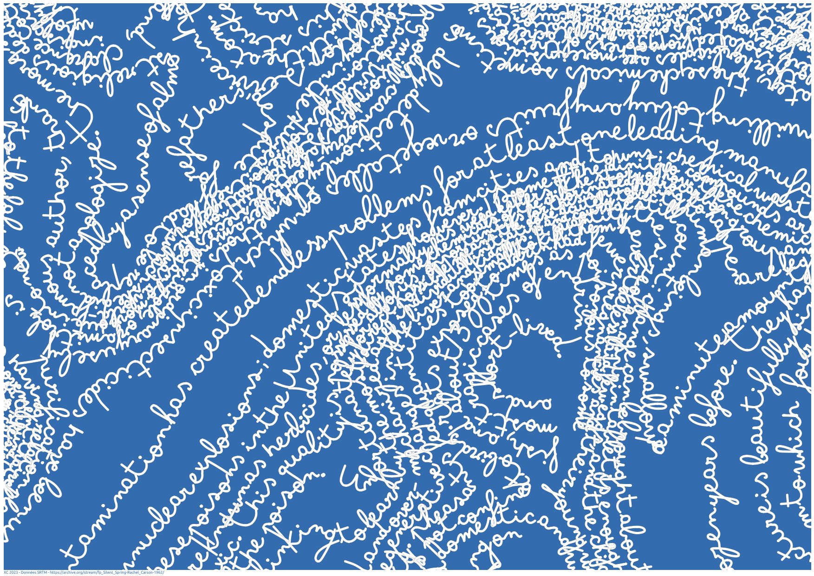

## Jour 2 : Lignes

__Silent Spring__

Les premières lignes qui me viennent à l'esprit : les courbes de niveau bien sûr, les itinéraires... et pourquoi pas le tracé d'un crayon ?

Va donc pour un trait de plume le long des courbes de niveau  : "Silent Spring", de Rachel Carson, sur le relief de sa terre natale. 

Le code du script "qgis processing" n'est pas très présentable, je le garde caché, mais peux partager le géopackage !

__Ressources :__

DEM : SRTM

Texte : https://archive.org/stream/fp_Silent_Spring-Rachel_Carson-1962/Silent_Spring-Rachel_Carson-1962_djvu.txt

Outils : QGis, Python.
