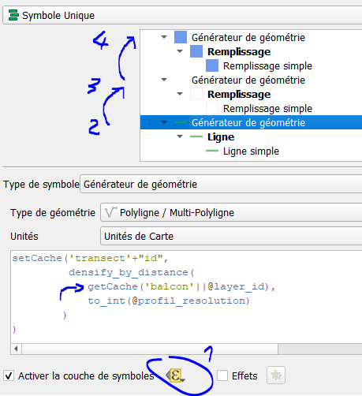

## Jour 20 : outdoor

__H.R.P. 2009__


<video src="maps/30days2023-day20-outdoor.mp4" controls title="Title"></video>

A partir d'une trajectoire (une ligne), de la trace empruntée, d'un MNT et d'une image de la zone (natural-earth ici), tous les éléments sont construits par expression QGis.

J'exploite le fait que, pour une couche donnée, les expressions sont exécutées dans un ordre particulier, en commençant par l'expression 'activer la couche de symboles' (expression exécutée une fois pour la couche), puis les différentes expressions pour chaque symbole (exécutées pour chaque entité).

Ainsi, dans la première expression, on peut construire des géométries (transect, etc..), les placer en cache pour les utiliser plus haut dans les expressions 'générateur de géométrie'. Pour enrichir les expressions, j'utilise aussi des fonctions 'utilisateur'.



C'est la couche portant la trajectoire qui est 'stylée', paramétrée avec le contrôle temporel "redessiner la couche uniquement".

__Exemple__

En simplifiant un peu pour produire un transect + un profil variant selon la progression du contrôleur temporel :


Quelques variables de projet
```
profil_width : largeur du transect (en m)
rast_name : nom du MNT (dem)
profil_x0, _y0 : position du profil en coordonnées carte
profil_fx, fy, fz : facteurs d'exagération du relief
```

Quelques fonctions 'utilisateur' (mise en cache)
```python
from qgis.utils import qgsfunction
from qgis.core import QgsMessageLog

ExpressionCache = {}

def _setCacheR(name, obj, ret):
    global ExpressionCache
    ExpressionCache[name] = obj
    return ret

def _setCache(name, obj):
    return _setCacheR(name, obj, obj)

def _getCache(name):
    global ExpressionCache
    try:
        return ExpressionCache[name]
    except Exception:
        return None

@qgsfunction(args="auto", group="Custom")
def setCacheR(name, obj, ret, feature, parent):
    return _setCacheR(name, obj, ret)

@qgsfunction(args="auto", group="Custom")
def setCache(name, obj, feature, parent):
    return _setCache(name, obj)

@qgsfunction(args="auto", group="Custom")
def getCache(name, feature, parent):
    return _getCache(name)
```

__La première expression (activer la couche)__

Astuce ici : l'expression doit retourner 1 pour rendre la couche visible. D'où l'utilisation d'une fonction setCacheR qui retourne une valeur donnée en 3eme paramètre.

```python
# récupérer et placer dans la variable @vol le trajet 
with_variable('vol', get_feature('fly', 'fid', '1'), 
# placer ds la variable @volgeom une version lissée du trajet
with_variable('volgeom',  smooth(geometry(@vol), 3),
# longueur (en m) parcourue en un pas de temps
with_variable('vol_resolution', length(@volgeom)/day(@animation_interval),
    # mise en cache de la géométrie
	setCacheR('volgeom', @volgeom, 1)
	
    # calcul d'un azimuth
	+
	setCacheR('pt1',
		line_interpolate_point(@volgeom, (@frame_number*@vol_resolution) )
		, 0
	) 

	+
	setCacheR('pt2', 
		line_interpolate_point(@volgeom, ((@frame_number+1)*@vol_resolution) )
		, 0
	)

	+
	setCacheR('azimuth', 
		azimuth(
			getCache('pt1'),
			getCache('pt2')
		)
		, 0
	)

	+
    # calcul du transect
	setCacheR('transect', 
		densify_by_distance( 
			make_line(
				project(getCache('pt1'), @profil_width/2, getCache('azimuth')-pi()/2 ), 
				project(getCache('pt1'), @profil_width/2, getCache('azimuth')+pi()/2 )
			),
			to_int(@profil_resolution)
		)
		, 0
	)
		
)))
```

Le premier symbole, de type "générateur de géométrie", ligne :\
L'expression ne fait que récupérer la géométrie transect mise en cache au préalable.
```python
getCache('transect')
```

Deuxième symbole : le profil. Générateur de géométrie 'polygone'.

```python
with_variable('geom', getCache('transect'),
	make_polygon(make_line(  
		make_point(@profil_x0 + @profil_fx*@profil_width, @profil_y0 - @profil_fy*@profil_depth),
		make_point(@profil_x0, @profil_y0-@profil_fy*@profil_depth),
		with_variable(
			'nodes',
			nodes_to_points(@geom),
			array_foreach(
				generate_series(1, num_points(@geom)),
				with_variable(
					'pt',
					point_n(@nodes, @element),
					make_point(
						@profil_x0+ @profil_fx*distance_to_vertex(@geom, @element-1),
						@profil_y0+ @profil_fy*@profil_fz*coalesce(raster_value(@rast_name, 1, @pt), 0)
					)
				)
			)
		)
	))
)
```
__données__

https://www.naturalearthdata.com/downloads/