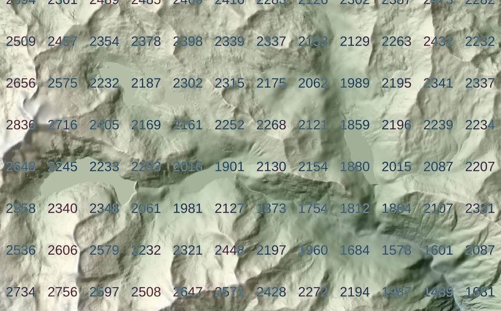

## Jour 21 : raster

__Style dynamique pour stat raster__



Ces codes permettent d'afficher la moyenne des valeurs de pixel de la bande 1 d'un raster, sur une grille fixe par rapport au canvas de la carte. Ici l'altitude moyenne.

Le principe : c'est sur une couche vectorielle (le polygone de l'étendue du raster par exemple) que le style "générateur de géométrie" construit une grille de point, points porteurs d'une valeur 'M', moyenne des valeurs de pixel calculée dynamiquement. 

Attention à la volumétrie du raster, il est chargé en mémoire par la fonction.

La fonction utilise la bibliothèque numpy, gdal.

Couche et canvas en coordonnées métrique. 

Deux variable de couche ou de projet :
```
cols : nombre de tuiles dans la largeur du canvas
rast_name : nom de la couche raster à exploiter (un MNT)
```

La fonction à créer, et améliorer bien sûr (c'est fait à la va-vite) :
```python
"""
Calcule la moyenne des pixels d'une région rectangulaire

: param rast_id: l'identifiant ou nom de la couche raster
: param extent: L'étendue (Polygon) de la zone à moyenner
: param num_band: Numéro de la bande raster à traiter
: returns: Moyenne de la bande num_band (float)
"""
current_rast = {}

@qgsfunction(args="auto", group="Custom", usesgeometry=False)
def getRectRastMean(rast_id, extent, num_band, feature, parent):
    try:
        rast = QgsProject.instance().mapLayer(rast_id)
        if rast is None:
            rast = QgsProject.instance().mapLayersByName(rast_id)[0]

        if rast is None:
            return None

        extent = extent.boundingBox()
        if rast.id() in current_rast.keys():
            ds = current_rast[rast.id()]
        else:
            ds = gdal.Open(rast.source())

        current_rast[rast.id()] = ds

        band = ds.GetRasterBand(num_band)
        if band is None:
            return None

        rextent = rast.extent()
        xmin, _, _, ymax = rextent.toRectF().getCoords()
        pixelWidth = rast.rasterUnitsPerPixelX()
        pixelHeight = rast.rasterUnitsPerPixelY()

        col = int((extent.xMinimum() - xmin) / pixelWidth)
        row = int((ymax - extent.yMaximum()) / pixelHeight)
        w = min(rast.width() - 1, max(1, int(extent.width() / pixelWidth)))
        h = min(rast.height() - 1, max(1, int(extent.height() / pixelHeight)))
        if col < 0 and col + w >= 0:
            w = col+w
            col = 0
        if row < 0 and row + h >= 0:
            h = row+h
            row = 0
        if col + w > rast.width():
            w = rast.width() - col
        if row + h > rast.height():
            h = rast.height() - row

        if w > 0 and h > 0 and col >= 0 and row >= 0 and col <= rast.width() and row <= rast.height():

            a = band.ReadAsArray(col, row, w, h).astype(np.uint16)
            if len(a.shape) > 0:
                return float(np.nanmean(a))
            else:
                return None
        else:
            return None
    except Exception as e:
        QgsMessageLog.logMessage(f"{e}", "Extensions")
        return None
```

Le générateur de géométrie sur la couche vectorielle (polygone étendue du raster) :
```python
with_variable('dx', @map_extent_width / @cols,
with_variable('dy', @dx, 
with_variable('rows', 1+(@map_extent_height // @dy), 
with_variable('cols', (@map_extent_width // @dx), 
	collect_geometries(
	array_filter(
		array_foreach(generate_series(0, @rows * @cols-1),
			with_variable( 'y',  @dy/2 + y_min(@map_extent) + @dy*(@element // @cols), 
				with_variable( 'x', @dx/2+ x_min(@map_extent) + @dx*(@element % @cols), 
					with_variable('mean',
						getRectRastMean(
							@rast_name,  
							make_rectangle_3points(
								make_point(@x-@dx/2, @y-@dy/2),
								make_point(@x-@dx/2, @y+@dy/2), 
								make_point(@x+@dx/2, @y+@dy/2)
							), 1
						), 
						case when @mean is null then make_point(@x, @y, 0.0, null) else make_point(@x, @y, 0.0, @mean) end
					)  
				)
			)
		)
		, @element is not null) 
	)
)))) 

```

Sous le générateur de géométrie, un symbole de police dont les caractères correpondent à la statistique associée à une tuile (noeud de la grille), stockée dans la dimension 'M' du point.

```python
to_string(to_int(m(geometry_n( $geometry,  @geometry_part_num ))))
```
__données__

https://geoservices.ign.fr/rgealti