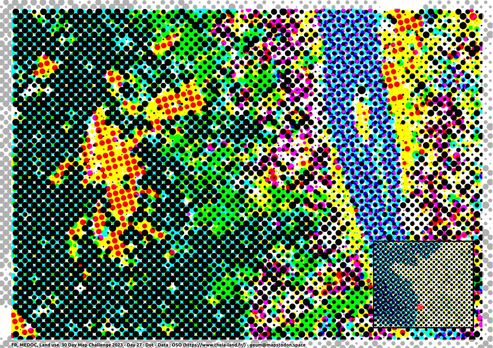
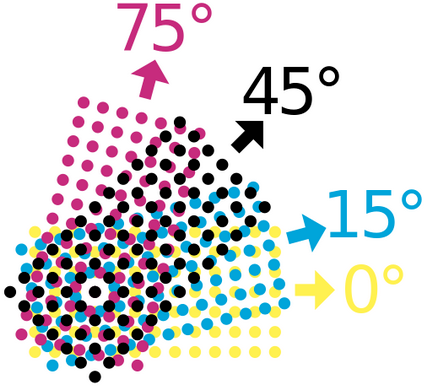

## Jour 27 : Dot

__trame CMYK__

Un modèle de traitement QGis qui construit 4 couches de points (quadrichromie Cyan, Magenta, Jaune, Noir) à partir d'un raster à 3 bandes Rouge, Vert, bleu. 

L'orientation des trames, leur mode de fusion en 'multiplication' fait le reste.

Le modèle : [rbg2cmyk-dots.model3](30DAYMAPCHALLENGE-2023/tree/master/algo/rbg2cmyk-dots.model3)

Le style associé : [rgb2cmyk-dots.qml](30DAYMAPCHALLENGE-2023/tree/master/styles/rgb2cmyk-dots.qml)

Les paramètres du modèle : 
- rvb : le raster en entrée (RVB, en coordonnées métriques)
- Les bandes R, V, B : généralement respectivement 1, 2, 3
- emprise : L'emprise à traiter (un clip du raster est effectué)
- cols : le nombre de points à générer, dans la largeur
- style : le fichier de style (utiliser plutôt le style fourni)

4 couches de points sont alors construites, la valeur de la couleur est stockée dans la dimension 'M' de l'entité. Le style exploite cette information.

Il n'y a qu'un seul style pour les 4 couches, une expression utilise les noms des couches générées par défaut pour adapter la couleur (cyan, magenta, yellow, black). 

Les variables de projets, noms des couches sont à adapter si besoin.

La couche d'origine (OSO ici) a été sauvée en image RGB au préalable.

Données : occupation du sol OSO (https://www.theia-land.fr/)