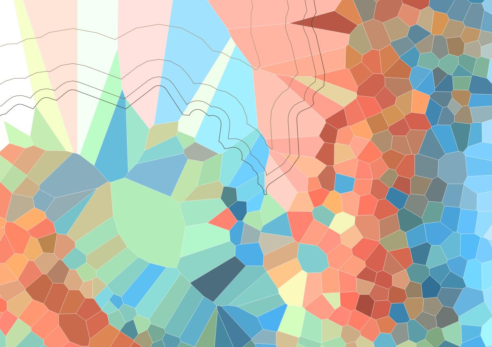
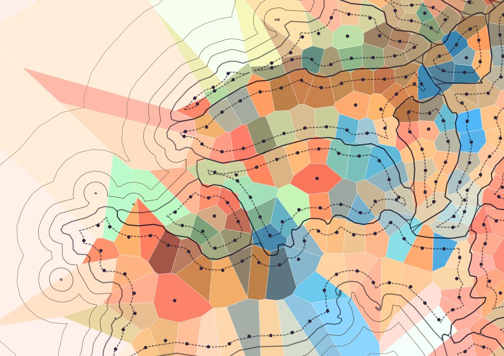
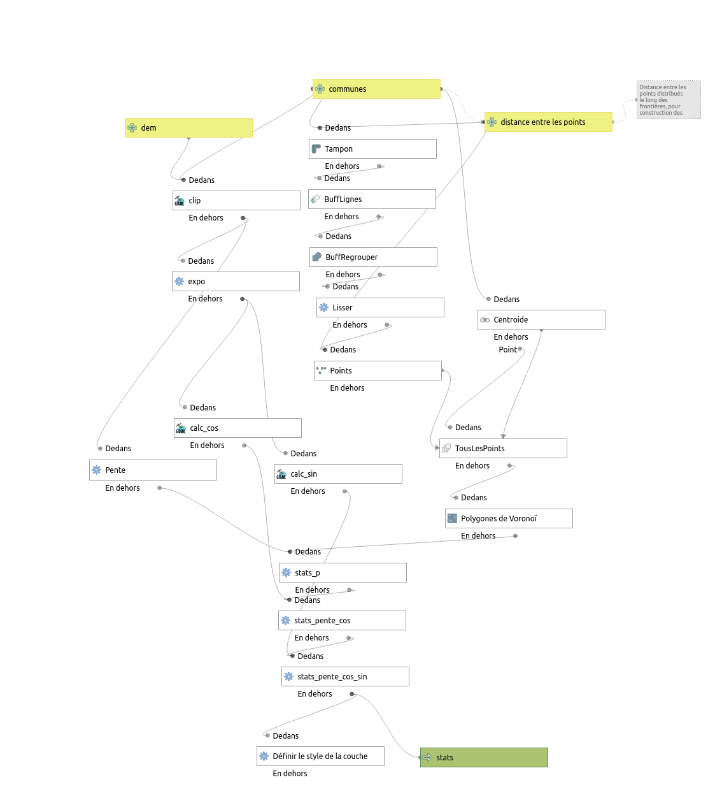

## Jour 3 : Polygones

__Exposition et pente__

Une idée de classer les communes par leur exposition (N-S-E-O)... mais trop grandes, des sous-parties s'imposent, et les polygones de voronoï étant toujours esthétiques, ils aident alors au découpage. 


Dans les tons froids, orientation nord et est, les tons chauds : sud et ouest.



La recette :

- répartition de points régulièrement espacés le long d'un buffer négatif des communes
- ajout des centroïdes des polygones
- génération des polygones de voronoï
- du modèle de terrain (SRTM), constuire pentes et exposition, et les dérivées cosinus et sinus de l'angle 'orientation' (pour en calculer une exposition moyenne)
- injecter les statistiques zonales (moyenne par polygone des couches raster 'pente', 'sinus', 'cosinus')
- et cela suffit pour un style dont la couleur est calculée par expression (pente : luminosité, exposition : couleur).



Et c'est l'occasion de tester la notion de 'modèle' de traitement QGis.



__Ressources :__

DEM : SRTM

Outils : QGis.

Bouts de code :

Le modèle dans le dossier [algos](30DAYMAPCHALLENGE-202/tree/master/algos)

Une fonction (modulo pour nombre flotant)
```python
@qgsfunction(args="auto", group="Custom")
def fmod(x, y, feature, parent):
    return math.fmod(x, y)
```

La 'rampe de couleurs' : [day3-exposition.xml](30DAYMAPCHALLENGE-2023/tree/master/styles/day3-exposition.xml)

L'expression pour la couleur :
```python
with_variable( 'color',
		ramp_color('polygons-exposition',  scale_linear(fmod(fmod(360-degrees(atan2( "s_mean" , "c_mean" ))+90,360)+360,360), 0,  360, 0, 1) ), 
		case when  "p_mean" > median("p_mean") then
			darker(@color, scale_exp( "p_mean" , median("p_mean"), maximum("p_mean"), 160, 100, 0.2))
		when  "p_mean" < median("p_mean") then
			lighter(@color, scale_exp( "p_mean" , minimum("p_mean"), median("p_mean"), 200, 100, 0.2))
		else @color end

	)
```