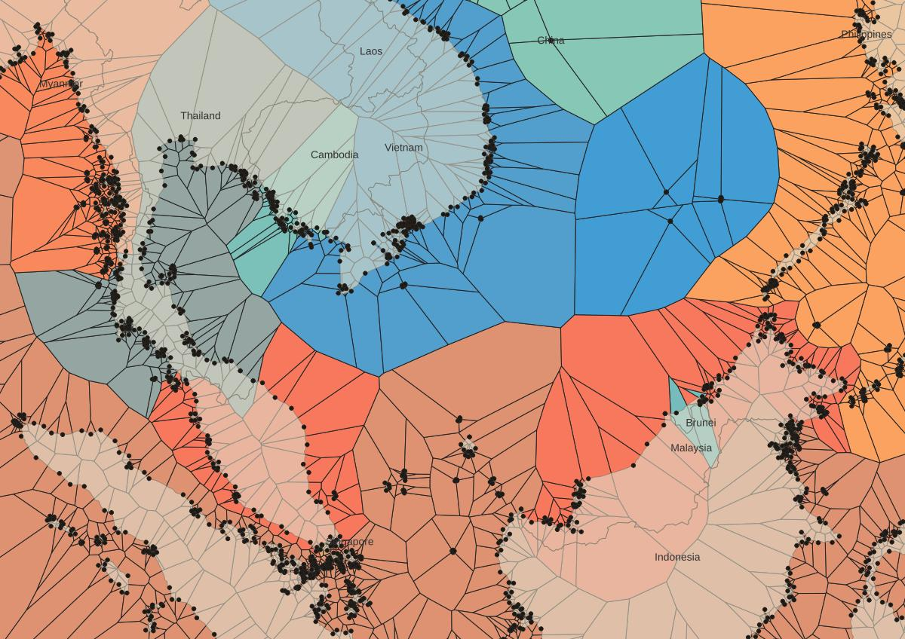

## Jour 6 : Asia

__Terres en mer__

Relief inversé, les pays déplacés, quelques rivières inventées.\
Vive les modèles de traitement QGis !

Mécanique :

- pays en mer constuits à l'aide des polygones de Voronoï, sur les noeuds de la ligne de côte. Les attributs (code pays) suivent, il suffit ensuite d'aggréger les polygones par pays (algo native:disolve)
- les capitales : des centroïdes + jointure attributaire.
- Cours d'eau : grass r.stream.extract

La difficulté : trouver la bonne projection pour travailler de ce coté de la sphère ! Ici : Asia Lambert Conformal Conic.

__Ressources__

- bathy : https://www.gebco.net/data_and_products/gridded_bathymetry_data/ 
- pays : https://www.naturalearthdata.com/downloads/
  