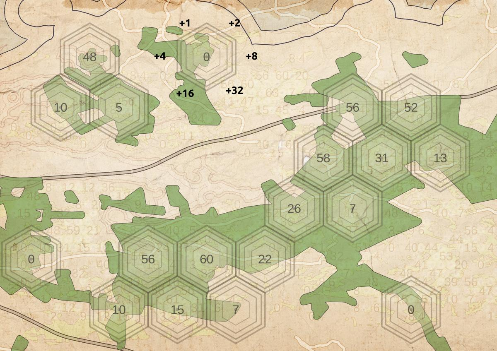

## Jour 9: Hexagons

__Fantasy map__

Un début... 

- extraction des forêts (Polygones Open Street Map)
- maillage de points sur grille hexagonale
- calcul d'une codification binaire de 'voisinage' 1+2+4... selon qu'il existe une forêts voisine...
- ... pour adapter un SVG : 1 parmi 64 pour couvrir tous les cas possibles.

__Ressources__

OSM - du coté de Faou, Bretagne
