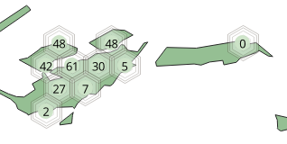

## Jour 9: Hexagons

__Fantasy map__

Un début... 


- extraction des forêts (Polygones Open Street Map)
- maillage de points sur grille hexagonale
- calcul d'une codification binaire de 'voisinage' 1+2+4... selon qu'il existe une forêts voisine...
- ... pour adapter un SVG : 1 parmi 64 pour couvrir tous les cas possibles.


__Ressources__

OSM - du coté de Faou, Bretagne


__Un peu de code...__

Ci-après un script python (à exploiter sous QGis, dans la console python) :

A partir de la couche de polygones sélectionnée et de l'emprise courante, il génère une couche de points situés dans les polygones, points codifiés (un champ 'neighborhood') selon le voisinage.

Codification binaire classique 1+2+4+8... selon quel point voisin est présent.

- Si aucun point voisin : 0
- Un voisin en haut à gauche : +1
- Un voisin en haut à droite : +2
- A gauche : +4 etc...

exemple ci-dessous, 48 = 16+32 : un voisin en dessous à gauche, un autre en bas à droite.



Il suffit ensuite de paramétrer le symbole SVG par une expression du type : 'fantasy/forest-'||  "neighborhood" || '.svg'\
... et dessiner 64 (ou 63) SVG !


[Les SVG ici](svg/). Vous pouvez les modifier pour faire encore mieux en paramétrant couleurs, épaisseur de trait... (https://docs.qgis.org/3.10/en/docs/user_manual/style_library/symbol_selector.html#marker-symbols).

Pour la mise en page : une image de fond (texture vieux papier glanée sur le web), et des modes de fusion 'multiplication' ou  'superposition' pour fondre un peu les éléments avec le fond.


__Le script__
```python
import math

from qgis.utils import iface
from qgis.PyQt.QtWidgets import QApplication
from qgis.PyQt.QtCore import QVariant
from qgis.core import (
    QgsProject,
    QgsField,
    QgsVectorLayer,
    QgsFeature,
    QgsGeometry,
    QgsPoint,
)
import processing


def buildGridHex(extent, resolution, crs):
    """
    Constructs a layer of points positioned on a hexagonal grid.

    resolution: width of the tile
    """
    layer = QgsVectorLayer("MultiPoint?crs={}".format(crs.authid()), "grid", "memory")
    layer.startEditing()
    layer.dataProvider().addAttributes(
        [
            QgsField("col", QVariant.Int),
            QgsField("row", QVariant.Int),
            QgsField("neighborhood", QVariant.Int),
        ]
    )
    layer.updateFields()

    feats = []

    xres, yres = resolution, (resolution * math.sqrt(0.75))
    nrows = int(extent.height() / yres)
    ncols = int(extent.width() / xres)
    for row in range(nrows):
        for col in range(ncols):
            x = extent.xMinimum() + col * xres
            y = extent.yMinimum() + row * yres
            dx = (row % 2) * (resolution / 2)
            vtx = QgsPoint(x + dx, y)
            newG = QgsGeometry(vtx)
            newF = QgsFeature()
            newF.setGeometry(newG)
            newF.setFields(layer.fields())
            newF.setAttribute("col", col)
            newF.setAttribute("row", row)
            newF.setAttribute("neighborhood", 0)
            feats.append(newF)

    layer.dataProvider().addFeatures(feats)
    layer.commitChanges()

    return layer


def updateNeighborhood(grid):
    """
    Code the 'neighborhood' field.

    +1 if a neighbor at the top left, +2 if a neighbor at the top right, etc...

          +1  / \  +2
        +4   |   |   +8
         +16  \ /  +32

    """
    grid.startEditing()

    points = {}

    for feat in grid.getFeatures():
        QApplication.processEvents()
        points[str(feat["col"]) + "-" + str(feat["row"])] = feat

    for feat in grid.getFeatures():
        c, r = feat["col"], feat["row"]
        k = ("{}-{}".format(c, r),)

        kvoisins = [
            "{}-{}".format(c - (r % 2 == 0), r + 1),
            "{}-{}".format(c + (r % 2 == 1), r + 1),
            "{}-{}".format(c - 1, r),
            "{}-{}".format(c + 1, r),
            "{}-{}".format(c - (r % 2 == 0), r - 1),
            "{}-{}".format(c + (r % 2 == 1), r - 1),
        ]

        neighborhood = 0
        for n, k in zip([1, 2, 4, 8, 16, 32], kvoisins):
            if k in points:
                neighborhood = neighborhood + n

        feat["neighborhood"] = neighborhood
        grid.updateFeature(feat)

    grid.commitChanges()


def intersection(grid, polys):
    r = processing.run(
        "native:intersection",
        {
            "INPUT": grid,
            "OVERLAY": polys,
            "INPUT_FIELDS": "",
            "OVERLAY_FIELDS": "",
            "OVERLAY_FIELDS_PREFIX": "",
            "GRID_SIZE": None,
            "OUTPUT": "TEMPORARY_OUTPUT",
        },
    )
    return r["OUTPUT"]

# Works with Current Layer and current Extent
NBTILES = 50
EXTENT = iface.mapCanvas().extent()
RESOLUTION = EXTENT.width() / NBTILES
forest = iface.mapCanvas().currentLayer()

# build points
grid = buildGridHex(EXTENT, RESOLUTION, iface.mapCanvas().mapSettings().destinationCrs())
# only in polygons
grid = intersection(grid, forest)
# Neighborhood
updateNeighborhood(grid)
QgsProject.instance().addMapLayer(grid)

```

